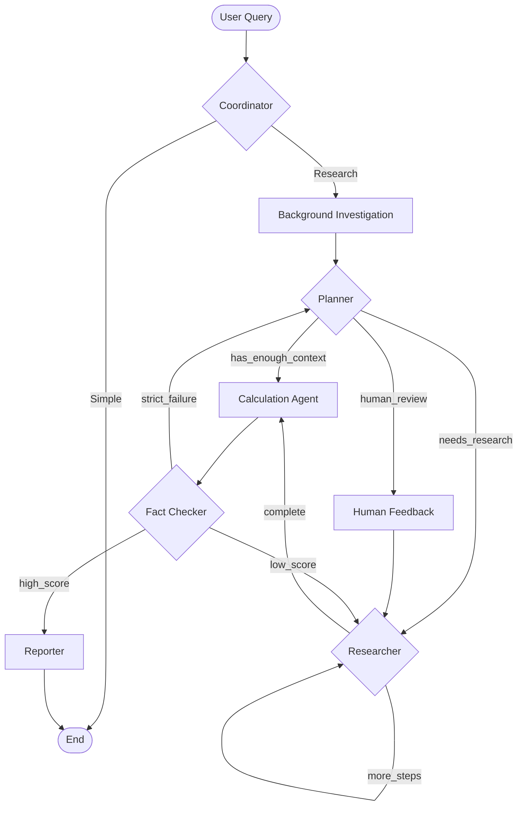

# CLAUDE.md

This file provides guidance to Claude Code when working with code in this repository.

## Project Overview

**Databricks Deep Research Agent** - A production-ready multi-agent research system with sophisticated metric calculation capabilities, built on LangGraph and deployed on Databricks.

**Current Branch**: `calc_engine` - Active development of metric calculation pipeline with UnifiedPlan architecture.

## Key References

Always align with official Databricks documentation:
 - https://docs.databricks.com/aws/en/generative-ai/agent-framework/author-agent
 - https://github.com/databricks-demos/dbdemos-notebooks/blob/main/product_demos/Data-Science/ai-agent/02-agent-eval/agent.py
 - https://github.com/databricks-demos/dbdemos-notebooks/tree/main/product_demos/Data-Science/ai-agent
 - **Structured Outputs**: https://docs.databricks.com/aws/en/machine-learning/model-serving/structured-outputs
 - **Reasoning Models**: https://docs.databricks.com/aws/en/machine-learning/model-serving/query-reason-models

## Critical: Structured Outputs and Reasoning Models

### Overview

**IMPORTANT CONSTRAINT**: Databricks models have specific requirements when using structured outputs (Pydantic schemas) that affect how reasoning models can be used.

### Reasoning Model Response Format

When using reasoning models (GPT-OSS with `reasoning_effort` or Claude with extended thinking), the response format is:

```python
response.content = [
    {'type': 'reasoning', 'summary': [...]},  # Thinking process
    {'type': 'text', 'text': '...'}           # Actual response
]
```

This two-element array format is **intentional and properly designated** - the system can extract the actual answer from the second element.

### Structured Output Methods

LangChain's `with_structured_output()` supports three methods:

1. **`method="json_schema"`** - ❌ NOT COMPATIBLE with reasoning models
   - Requires a "name" field in the JSON schema
   - databricks_langchain doesn't provide this field automatically
   - Error: `json_schema must have a "name" field`
   - **Workaround**: Use models WITHOUT `reasoning_effort`

2. **`method="json_mode"`** - ⚠️  REQUIRES "json" in prompt
   - Works with reasoning models
   - Requires the word "json" in the prompt text
   - Error if missing: `"messages" must contain the word "json" in some form`
   - Less strict schema validation than json_schema

3. **`method="function_calling"`** - ❌ NOT COMPATIBLE with reasoning models
   - Error: `Model output is not in expected format`

### How This Project Uses Structured Outputs

**CRITICAL**: This project uses a **custom implementation** that fixes bugs in vanilla `databricks_langchain`!

#### Why Vanilla databricks_langchain is Broken

Testing reveals that `ChatDatabricks.with_structured_output(method="json_schema")` **DOES NOT WORK**:

```python
# ❌ FAILS with ALL models (Claude, GPT-OSS) regardless of reasoning
from databricks_langchain import ChatDatabricks

llm = ChatDatabricks(endpoint="databricks-gpt-oss-120b")  # No reasoning
structured_llm = llm.with_structured_output(schema=MySchema, method="json_schema")
result = await structured_llm.ainvoke("...")
# ERROR: json_schema must have a "name" field
```

**Root cause**: `databricks_langchain` doesn't add the required "name" field to the JSON schema format.

#### This Project's Custom Solution

**File**: `src/deep_research_agent/core/rate_limited_chat_model.py`

The project implements its OWN structured output system:

1. **`RateLimitedChatModel`** (line 25) - Wraps ChatDatabricks with rate limiting
2. **`RateLimitedChatModel.with_structured_output()`** (line 382) - Returns custom wrapper
3. **`StructuredOutputWrapper`** (line 414) - The magic happens here:
   - `_build_response_format()` (line 511) - **Adds missing "name" field** (line 588)
   - `ainvoke()` (line 597) - Calls underlying model with proper format
   - Uses custom `parse_llm_response()` (line 671) - Handles reasoning traces

**Key Fix** (rate_limited_chat_model.py:585-592):
```python
return {
    "type": "json_schema",
    "json_schema": {
        "name": schema_name,      # ← This fixes the databricks_langchain bug!
        "schema": schema_dict,
        "strict": True
    }
}
```

**Configuration** (conf/base.yaml):
```yaml
# TIER 5: STRUCTURED - Works with custom implementation
structured:
  endpoints:
    - databricks-gpt-oss-120b     # PRIMARY
    - databricks-gpt-oss-20b      # Fallback
  temperature: 0.3
  max_tokens: 25000
  # NO reasoning_effort - Keeps responses simple
  tokens_per_minute: 50000
```

**Usage Pattern** (hybrid_planner.py, spec_analyzer.py):
```python
# Get RateLimitedChatModel (NOT ChatDatabricks directly!)
llm = model_manager.get_chat_model("structured")  # Returns RateLimitedChatModel

# Use custom with_structured_output (NOT databricks_langchain's)
structured_llm = llm.with_structured_output(
    schema=EntityMetricsOutput,
    method="json_schema"  # Works because of custom implementation
)

response = await structured_llm.ainvoke(messages)
# Returns validated Pydantic object
```

**IMPORTANT**: The project's structured output works because it uses `RateLimitedChatModel`, not vanilla `ChatDatabricks`!

### Best Practices

**✅ DO (Using Our Custom Implementation)**:
- Use the "structured" tier for Pydantic schema generation
- Use `method="json_schema"` for strict validation with our custom implementation
- You CAN combine `reasoning_effort` with `method="json_schema"` when using `RateLimitedChatModel`
- Access models through `model_manager.get_chat_model()` to get our custom wrapper

**❌ DON'T (Vanilla databricks_langchain Limitations)**:
- Use `ChatDatabricks.with_structured_output()` directly (missing "name" field bug)
- Use `method="json_mode"` without "json" in the prompt
- Use `method="function_calling"` with reasoning models
- Bypass ModelManager (you'll lose the custom fixes)

### Reasoning Model Usage with Structured Output

**IMPORTANT**: Our custom `RateLimitedChatModel` **DOES** support reasoning + structured output!

#### Option 1: Structured Output WITH Reasoning (Recommended for Complex Extraction)

Our custom implementation handles the two-element reasoning trace `[reasoning, text]` automatically:

```python
# Create a tier with reasoning enabled (optional - can add to conf/base.yaml)
config_override = {
    "model_tiers": {
        "structured_with_reasoning": {
            "endpoints": ["databricks-gpt-oss-120b"],
            "temperature": 0.3,
            "max_tokens": 25000,
            "reasoning_effort": "medium",  # ✅ Works with our custom implementation!
            "tokens_per_minute": 50000
        }
    }
}

# Use it
llm = model_manager.get_chat_model("structured_with_reasoning")
structured_llm = llm.with_structured_output(
    schema=EntityMetricsOutput,
    method="json_schema"  # ✅ Works because we add "name" field
)

result = await structured_llm.ainvoke(messages)
# Returns validated Pydantic object
# Reasoning trace is automatically parsed and filtered
```

**Benefits of Reasoning + Structured Output**:
- More thoughtful metric extraction
- Better handling of edge cases
- Higher quality confidence scores
- Still returns validated Pydantic objects
- Reasoning traces are automatically handled by `parse_llm_response()`

#### Option 2: Two Separate Calls (When You Need Explicit Reasoning Access)

```python
# Step 1: Reasoning model for complex analysis
reasoning_llm = model_manager.get_chat_model("analytical")  # Has reasoning_effort
reasoning_response = await reasoning_llm.ainvoke(analysis_prompt)

# Step 2: Structured model for schema extraction
structured_llm = model_manager.get_chat_model("structured")  # No reasoning_effort
structured_response = await structured_llm.with_structured_output(schema).ainvoke(extraction_prompt)
```

#### Option 3: json_mode with Vanilla databricks_langchain (Not Recommended)

**Note**: This is only if you bypass ModelManager and use vanilla `ChatDatabricks` directly. Not recommended.

```python
# ⚠️ Using vanilla ChatDatabricks (bypasses our fixes)
llm_with_reasoning = ChatDatabricks(
    endpoint="databricks-gpt-oss-120b",
    extra_params={"reasoning_effort": "medium"}
)

structured_llm = llm_with_reasoning.with_structured_output(
    schema=MySchema,
    method="json_mode"  # Less strict validation, no "name" field requirement
)

# CRITICAL: Prompt MUST contain "json"
prompt = "Analyze this data and return JSON with the following structure..."
response = await structured_llm.ainvoke(prompt)
```

**Why Option 1 (Reasoning + json_schema with RateLimitedChatModel) is Better**:
- ✅ Strict Pydantic validation
- ✅ Automatic reasoning trace parsing
- ✅ Type-safe returns
- ✅ Better error messages
- ✅ Works with all Databricks models

### Databricks JSON Schema Limitations

From Databricks docs, JSON schemas have these constraints:
- Maximum 64 keys in schema
- No `pattern`, `anyOf`, `oneOf`, `allOf`, `$ref`
- No `minProperties`, `maxProperties`, `maxLength` enforcement
- Heavily nested schemas produce lower quality results
- **Recommendation**: Keep schemas flat and simple

### Related Files

- **Configuration**: `conf/base.yaml` - "structured" tier definition
- **Usage**: `src/deep_research_agent/core/metrics/hybrid_planner.py:607-610`
- **Usage**: `src/deep_research_agent/core/metrics/spec_analyzer.py:1690-1693`
- **Models**: `src/deep_research_agent/core/structured_models.py` - Pydantic schemas
- **Model Manager**: `src/deep_research_agent/core/model_manager.py:298` - Tier validation

## Quick Commands

### Testing
```bash
# Run active test suite (19 tests)
PYTHONPATH=src pytest tests/ -v

# Core functionality tests
PYTHONPATH=src pytest tests/test_real_end_to_end.py -v          # Full multi-agent workflow
PYTHONPATH=src pytest tests/test_reporter_agent.py -v           # Reporter agent
PYTHONPATH=src pytest tests/test_metrics_pipeline.py -v         # Metric calculation
PYTHONPATH=src pytest tests/test_metrics_integration.py -v      # Metric integration

# Infrastructure tests
PYTHONPATH=src pytest tests/test_async_context_invoke.py -v     # Async executor
PYTHONPATH=src pytest tests/test_token_budget_tracker.py -v     # Rate limiting
PYTHONPATH=src pytest tests/test_observation_serialization.py -v # State management

# Calculation engine tests (calc_engine branch)
PYTHONPATH=src pytest tests/test_formula_calculation_bug.py -v  # Formula extraction
PYTHONPATH=src pytest tests/test_fstring_edge_cases.py -v       # Code generation
PYTHONPATH=src pytest tests/test_phase2_metadata_enrichment_integration.py -v
PYTHONPATH=src pytest tests/test_phase3_hybrid_planner_integration.py -v
```

### Development Setup
```bash
# Install dependencies with uv (recommended)
uv sync

# Or use pip
pip install -r requirements.txt
```

### Configuration
```bash
# Primary configuration file
conf/base.yaml  # ← ACTIVE configuration (edit this!)

# Test configurations
conf/test.yaml          # Test overrides
conf/test_hybrid.yaml   # Hybrid report generation tests
conf/integration_test.yaml  # Integration test config
```

## Architecture

### Core Architecture: 6-Agent Multi-Agent System

The system uses **EnhancedResearchAgent** with 6 specialized agents orchestrated by LangGraph:

```
DatabricksCompatibleAgent (MLflow wrapper)
  └─> EnhancedResearchAgent (main orchestrator)
      ├─> Coordinator Agent        (pattern matching, no LLM)
      ├─> Background Investigation (search tools, no LLM)
      ├─> Planner Agent            (LLM: creates research plan)
      ├─> Researcher Agent         (LLM: executes research steps)
      ├─> Calculation Agent        (NEW: executes UnifiedPlan for metrics)
      ├─> Fact Checker Agent       (LLM: verifies claims)
      └─> Reporter Agent           (LLM: generates final report)
```

### Execution Flow (from enhanced_research_agent.py)



### 5-Tier Model System (base.yaml L13-82)

Configurable in `conf/base.yaml`:

- **micro**: Ultra-lightweight (databricks-gpt-oss-20b, databricks-gemma-3-12b)
  - Pattern matching, entity extraction
  - 200K tokens/min, temp=0.5

- **simple**: Lightweight (databricks-gpt-oss-20b, databricks-llama-4-maverick)
  - Query generation, claim extraction, validation
  - 200K tokens/min, temp=0.5

- **analytical**: Medium (databricks-gpt-oss-120b, databricks-gpt-oss-20b)
  - Research synthesis, fact checking, planning
  - 200K tokens/min, temp=0.7
  - Used by: Planner, Researcher, Fact Checker

- **complex**: Heavy (databricks-gpt-oss-120b, databricks-claude-3-7-sonnet, databricks-claude-sonnet-4)
  - Report generation, complex tables, synthesis
  - 50K tokens/min, temp=0.7
  - Used by: Reporter

- **structured**: JSON schema compliance (databricks-claude-sonnet-4, databricks-claude-3-7-sonnet, databricks-gpt-oss-120b)
  - Complex Pydantic models, strict field name compliance
  - 50K tokens/min, temp=0.3
  - Used by: Unified Planning (calculation specs)

### Reporter Agent: 3-Tier Fallback Architecture

**Documentation**: See `docs/REPORTER_GENERATION_MODES.md` for comprehensive guide

The Reporter implements a sophisticated 3-tier fallback system ensuring robust report generation:

```
TIER 1: Hybrid Mode (calculation-based, best quality)
  ↓ [Fallback if calculation_results missing]
TIER 2: Section-by-Section (observation-based, production default)
  ↓ [Fallback if dynamic_sections missing]
TIER 3: Template Mode (basic fallback, rarely used)
```

**Tier 1 - Hybrid Multi-Pass** (agents/reporter.py:566-678):
- **Prerequisites**: `state.calculation_results` + `state.unified_plan`
- **3 Phases**:
  1. Extract calculation context from top observations
  2. Generate narrative with table anchors `[TABLE: id]`
  3. Programmatically generate tables from structured data
- **Best for**: Tax comparisons, financial modeling, metric-heavy queries
- **Output**: Deterministic tables + narrative + formulas

**Tier 2 - Section-by-Section** (agents/reporter.py:792-859) **← PRODUCTION WORKHORSE**:
- **Prerequisites**: `state.observations` + `state.current_plan.suggested_report_structure`
- **2 Steps**:
  1. Analysis: LLM analyzes observations per section
  2. Formatting: Build final report with adaptive structure
- **Best for**: Qualitative research, narrative synthesis, most queries
- **Output**: High-quality narrative + LLM-generated tables (may vary in quality)
- **Fallback from**: Tier 1 if calc unavailable

**Tier 3 - Template** (agents/reporter.py:732-789) **← LEGACY FALLBACK**:
- **Prerequisites**: `state.observations` (minimal)
- **Process**: One-shot LLM call with basic template
- **Used when**: Dynamic sections unavailable (rare)
- **Output**: Generic report structure

**Configuration** (conf/base.yaml L148-195):
```yaml
agents:
  reporter:
    generation_mode: hybrid  # Try hybrid first
    use_structured_pipeline: true
    enable_structured_generation: true

    hybrid_settings:
      fallback_on_empty_observations: true  # Enable graceful degradation
      calc_selector_top_k: 60
      enable_async_blocks: false
```

**Key Insight**: System ALWAYS produces a report - gracefully degrades when advanced features unavailable.

### Calculation Agent Architecture (NEW - calc_engine branch)

**Location**: `src/deep_research_agent/agents/calculation_agent.py`

**Purpose**: Executes UnifiedPlan for deterministic, auditable metric calculations

**Pipeline** (base.yaml L221-305):
```
Research Observations
    ↓
Unified Planning (hybrid planner)
    ↓
Data Point Extraction (per observation)
    ↓
Formula Discovery (3-tier system)
    ↓
Sandboxed Python Execution
    ↓
Validation & Provenance
    ↓
Reporter (with formulas & derivations)
```

**Key Features**:
- **Hybrid Planner**: Combines LLM planning with structured extraction
- **Sandboxed Execution**: RestrictedPython sandbox for security
- **Formula Discovery**: Pattern matching → LLM extraction → synthesis
- **Cell-Level Derivation**: Every table cell has provenance
- **Multi-Dimensional Support**: Country × scenario × metric calculations

**Configuration** (`conf/base.yaml`):
```yaml
metrics:
  enabled: true                    # Master switch
  use_pipeline_v2: true           # New calculation pipeline
  use_unified_planning: true      # UnifiedPlan-based (vs legacy metric matching)

  unified_planning:
    model: structured              # Use specialized tier for JSON compliance
    force_hybrid_planner: true     # Always use hybrid planner

  formula_discovery:
    enabled: true                  # 3-tier formula discovery
    use_pattern_matching: true     # Tier 1: Regex-based
    use_llm_extraction: true       # Tier 2: LLM-based
    use_synthesis: true            # Tier 3: Synthesis from examples

  execution:
    timeout_seconds: 5             # Per-calculation timeout
    memory_limit_mb: 100           # Memory limit
    enable_sandbox: true           # RestrictedPython (required)
    enable_parallel_execution: true # ParallelCalculationExecutor
```

### Report Generation: Hybrid Mode (base.yaml L148-195)

**Configured in** `conf/base.yaml`:

```yaml
reporter:
  generation_mode: hybrid         # section_by_section | hybrid
  use_structured_pipeline: true  # Programmatic table generation
  enable_structured_generation: true  # Pydantic models

  hybrid_settings:
    enable_async_blocks: false         # Async table generation
    calc_selector_top_k: 60           # Top observations for calculations
    calc_recent_tail: 20              # Recent observations
    max_calc_prompt_chars: 60000      # Prompt size limit

    # Table validation (5-layer defense against inline tables)
    enable_table_validation: true     # Detect inline tables
    auto_recovery_enabled: true       # Auto-insert anchors
    table_detection_threshold: 3      # Min rows to detect table
    enable_phase3_fallback: true      # Fallback anchor insertion
```

**Hybrid Mode Flow**:
1. **Phase 1**: Extract calculation context from observations
2. **Phase 2**: Generate holistic report narrative with table anchors `[TABLE: id]`
3. **Phase 3**: Execute calculations and generate actual tables
4. **Phase 4**: Replace anchors with rendered tables

**Benefits**:
- Separates narrative from complex table logic
- Reduces inline table hallucinations
- Enables deterministic calculation verification
- Provides full formula transparency

### Configuration System

**PRIMARY CONFIG**: `conf/base.yaml` (469 lines)
- Multi-agent settings (L86-217)
- 5-tier model system (L13-82)
- Metric calculation pipeline (L221-305)
- Report generation modes (L148-195)
- Rate limiting (L357-398)
- Search providers (L308-325)
- Workflow settings (L328-343)

**Override Configs**:
- `conf/test.yaml` - Test overrides
- `conf/test_hybrid.yaml` - Hybrid report testing
- `conf/integration_test.yaml` - Integration tests
- `conf/deploy/*.yaml` - Deployment configs

**Environment Variables**:
- `BRAVE_API_KEY` - Brave search (required)
- `TAVILY_API_KEY` - Tavily search (optional, disabled by default)
- `DATABRICKS_HOST` - Databricks workspace
- `DATABRICKS_TOKEN` - Auth token

**Search Providers** (base.yaml L308-325):
- **Brave Search**: ENABLED (20 results, 30s timeout)
- **Tavily Search**: DISABLED

### Rate Limiting Architecture

**Global Strategy** (base.yaml L357-398):
- **Sequential Execution**: `max_concurrent_per_endpoint: 2` (was 1)
- **Exponential Backoff**: 15s base → 120s max (8 retries)
- **Phase Delays**: Strategic pauses between pipeline stages
  - After research: 8s
  - Before report: 12s
  - Between sections: 5s
- **Token Tracking**: Sliding window (60s) with 90% safety margin

**Per-Tier Limits** (defined in model config):
- micro/simple/analytical: 200K tokens/min
- complex/structured: 50K tokens/min

### Key File Locations

**Core Agents**:
- `src/deep_research_agent/enhanced_research_agent.py` - Main orchestrator
- `src/deep_research_agent/databricks_compatible_agent.py` - MLflow wrapper
- `src/deep_research_agent/agents/coordinator.py` - Request classification
- `src/deep_research_agent/agents/planner.py` - Research planning
- `src/deep_research_agent/agents/researcher.py` - Step execution
- `src/deep_research_agent/agents/calculation_agent.py` - Metric calculations (NEW)
- `src/deep_research_agent/agents/fact_checker.py` - Verification
- `src/deep_research_agent/agents/reporter.py` - Report generation

**Calculation Pipeline** (calc_engine branch):
- `src/deep_research_agent/core/metrics/hybrid_planner.py` - UnifiedPlan creation
- `src/deep_research_agent/core/metrics/planner.py` - Calculation planning
- `src/deep_research_agent/core/metrics/executor.py` - Sandboxed execution
- `src/deep_research_agent/core/metrics/sandbox.py` - RestrictedPython wrapper
- `src/deep_research_agent/core/metrics/formula_extractor.py` - Formula discovery
- `src/deep_research_agent/core/metrics/data_context.py` - Data access API
- `src/deep_research_agent/core/metrics/unified_models.py` - UnifiedPlan models

**State Management**:
- `src/deep_research_agent/core/multi_agent_state.py` - EnhancedResearchState (100+ fields)
- `src/deep_research_agent/core/state_manager.py` - State utilities
- `src/deep_research_agent/core/plan_models.py` - Research plan models

**Workflow**:
- `src/deep_research_agent/workflow_nodes_enhanced.py` - LangGraph nodes

**Tools**:
- `src/deep_research_agent/tools_brave.py` - Brave Search
- `src/deep_research_agent/tools_tavily.py` - Tavily Search
- `src/deep_research_agent/core/web_content_fetcher.py` - Full page fetching

## Testing Architecture

**Active Tests** (19 tests in `tests/`):

**Core Multi-Agent System**:
- `test_real_end_to_end.py` - Full 6-agent workflow (PRIMARY E2E)
- `test_reporter_agent.py` - Reporter with captured state fixtures
- `test_deadlock_prevention.py` - Circuit breakers, routing policy

**Calculation Engine** (calc_engine branch):
- `test_metrics_pipeline.py` - Sandboxed execution, MetricDataContext
- `test_metrics_integration.py` - Full pipeline integration
- `test_reporter_structured.py` - Structured table generation
- `test_formula_calculation_bug.py` - Formula extraction bugs
- `test_fstring_edge_cases.py` - F-string converter
- `test_phase2_metadata_enrichment_integration.py` - Constraint extraction
- `test_phase3_hybrid_planner_integration.py` - UnifiedPlan creation
- `test_hybrid_metadata_enrichment_integration.py` - Full metadata pipeline

**Infrastructure**:
- `test_async_context_invoke.py` - AsyncExecutor.run_async_safe (CRITICAL)
- `test_token_budget_tracker.py` - Rate limiting
- `test_observation_serialization.py` - Observation models
- `test_redaction_utils.py` - PII redaction
- `test_table_preprocessor_integration.py` - Table preprocessing
- `test_regression_prevention.py` - Regression validation

**Testing Utilities**:
- `test_state_capture_fix.py` - State capture system
- `test_state_capture_comprehensive.py` - Comprehensive state capture

**Deprecated**: `tests/OLD/` directory (31 old tests - IGNORE)

## Important Implementation Notes

### Pydantic Everywhere Architecture (StructuredObservation)

**Implementation Status**: ✅ COMPLETE (as of October 2025)

The codebase follows a **"Pydantic Everywhere"** strategy for handling observations. This architectural decision ensures type safety and consistency throughout the multi-agent system.

#### Core Principle
- **Internal Representation**: `StructuredObservation` Pydantic objects are used EVERYWHERE internally
- **Serialization Boundaries**: Conversion to/from dicts happens ONLY at JSON boundaries (file I/O, LangGraph state passing)
- **No Mixed Types**: Never mix dict access patterns (`.get()`) with object attribute access (`.content`)

#### Key Components

**StructuredObservation Model** (`core/structured_models.py`):
- Primary observation representation throughout the system
- Validated Pydantic model with fields: content, entity_tags, confidence, relevance_score, metadata, etc.
- Methods: `from_dict()`, `to_dict()`, `from_string()`

**Type Annotations** (fixed):
```python
# core/plan_models.py - Step class
observations: Optional[List['StructuredObservation']] = Field(
    default=None,
    description="Observations made during execution as StructuredObservation objects"
)

# core/multi_agent_state.py - EnhancedResearchState
observations: Annotated[
    List[StructuredObservation],  # NOT List[Dict[str, Any]]
    use_latest_value
]
new_observations: Annotated[
    List[StructuredObservation],  # NOT List[Dict[str, Any]]
    use_latest_value
]
```

**Serialization Utilities** (`core/serialization_utils.py`):
```python
# Custom JSON encoder/decoder for Pydantic objects
class ObservationJSONEncoder(json.JSONEncoder):
    """Handles StructuredObservation → dict conversion at JSON boundaries"""

class ObservationJSONDecoder:
    """Handles dict → StructuredObservation restoration from JSON"""

# Utility functions for state serialization
serialize_state_for_json(state)      # For JSON file saving
deserialize_state_from_json(json_str) # For JSON file loading
serialize_for_langgraph(state)        # For LangGraph state passing
deserialize_from_langgraph(state_dict) # For LangGraph state restoration
```

**Safe Compatibility Helper** (`core/multi_agent_state.py`):
```python
@staticmethod
def safe_get_observation_content(obs: Union[Dict, StructuredObservation, str]) -> str:
    """Extract content from observation regardless of format.

    Provides compatibility during migration and handles edge cases.
    """
    if isinstance(obs, StructuredObservation):
        return str(obs.content if obs.content else "")
    elif isinstance(obs, dict):
        return str(obs.get("content", ""))
    elif isinstance(obs, str):
        return obs
    else:
        logger.warning(f"Unexpected observation type: {type(obs)}")
        return str(obs)
```

#### Usage Patterns

**✅ CORRECT - Direct attribute access**:
```python
# Working with observations internally
for obs in state["observations"]:
    print(obs.content)           # Direct attribute access
    print(obs.entity_tags)        # Type-safe access
    print(obs.confidence)         # No KeyError risk

# Adding new observations
structured_obs = ensure_structured_observation(raw_data)
state["observations"].append(structured_obs)  # Append object directly
```

**❌ WRONG - Dict access patterns**:
```python
# DON'T DO THIS - will cause AttributeError
obs.get("content", "")  # StructuredObservation has no .get() method

# DON'T DO THIS - unnecessary conversion
obs_dict = structured_obs.to_dict()
state["observations"].append(obs_dict)  # Should append object
```

#### State Serialization Flow

```
Internal Processing (Pydantic Objects)
    ↓
JSON Save → serialize_state_for_json() → Converts to dicts
    ↓
JSON File (dicts)
    ↓
JSON Load → deserialize_state_from_json() → Restores to objects
    ↓
Internal Processing (Pydantic Objects)
```

```
LangGraph Node A (Pydantic Objects)
    ↓
State Pass → serialize_for_langgraph() → Converts to dicts
    ↓
LangGraph Transport (dicts)
    ↓
State Receive → deserialize_from_langgraph() → Restores to objects
    ↓
LangGraph Node B (Pydantic Objects)
```

#### Benefits
1. **Type Safety**: IDE autocomplete and type checking work correctly
2. **Validation**: Pydantic validates at object creation time
3. **Consistency**: Single access pattern throughout codebase
4. **Clear Boundaries**: Only 2 places need dict conversion (JSON save/load)
5. **Better Debugging**: Objects have informative repr() for debugging

#### Migration Notes
- The `safe_get_observation_content()` helper provides backward compatibility
- All new code should use StructuredObservation objects directly
- Fixtures are automatically migrated using `ObservationJSONDecoder`

### Multi-Agent Mocking Pattern

**CRITICAL**: Use high-level graph mocking, NOT low-level LLM mocking:

```python
# ✅ CORRECT: Mock at graph level
with patch.object(enhanced_agent, 'graph') as mock_graph:
    mock_graph.ainvoke = AsyncMock(return_value={
        "final_report": "...",
        "plan": {...},
        # Complete state response
    })
    result = await enhanced_agent.predict(request)

# ❌ WRONG: Low-level LLM mocking causes response order issues
# Different agents use different LLM patterns:
# - Coordinator: Pattern matching (NO LLM)
# - Background Investigation: Search tools (NO LLM)
# - Planner/Researcher/Reporter: LLM calls
with patch.object(ChatDatabricks, 'ainvoke') as mock_llm:
    mock_llm.side_effect = [resp1, resp2]  # Wrong order! Will fail!
```

### State Management Patterns

**EnhancedResearchState** (100+ fields in `core/multi_agent_state.py`):

```python
from deep_research_agent.core.multi_agent_state import EnhancedResearchState, StateManager

# Initialize state
state = StateManager.initialize_state(
    research_topic="Your question",
    config={
        "enable_iterative_planning": True,
        "max_plan_iterations": 3,
        "enable_grounding": True,
        "auto_accept_plan": True
    }
)

# Track agent handoffs
state = StateManager.record_handoff(
    state,
    from_agent="planner",
    to_agent="researcher",
    reason="Plan approved"
)

# Add observations
state = StateManager.add_observation(
    state,
    "Found 15 relevant studies",
    step=current_step
)
```

### Async Context Handling

**CRITICAL BUG FIX** (test_async_context_invoke.py):

The system uses `AsyncExecutor.run_async_safe()` to call async code from sync contexts (e.g., MLflow serving). This was broken and is now fixed:

```python
from deep_research_agent.core.async_utils import AsyncExecutor

# In sync context (e.g., predict() method)
result = AsyncExecutor.run_async_safe(async_operation())  # ✅ Works now!
```

**Used in**:
- `core/rate_limited_chat_model.py` - Rate-limited LLM calls
- `server/fastapi_server.py` - FastAPI async routes
- `enhanced_research_agent.py` - Workflow invocation

### Configuration Override Pattern

**Test configuration** (used in all test files):

```python
config_override = {
    "multi_agent": {"enabled": True},
    "agents": {
        "planner": {"model": "analytical"},
        "researcher": {"model": "analytical"}
    },
    "metrics": {
        "enabled": True,
        "use_pipeline_v2": True
    }
}

agent = EnhancedResearchAgent(config_override=config_override)
```

### Metric Calculation Usage

**Enable in config**:
```yaml
metrics:
  enabled: true
  use_pipeline_v2: true
  use_unified_planning: true
```

**Automatic invocation**: Calculation Agent runs between Researcher and Reporter when `metrics.enabled: true`

**Manual invocation**:
```python
from deep_research_agent.agents.calculation_agent import CalculationAgent

calc_agent = CalculationAgent(llm=llm, config=config)
result = await calc_agent.execute_unified_plan(state)
```

## Documentation

**Full Documentation Index**: See `docs/README.md` for complete documentation catalog

**Main Docs** (`docs/`):
- `ARCHITECTURE.md` - System architecture (needs update with Calculation Agent)
- `CONFIGURATION_GUIDE.md` - Configuration details
- `IMPLEMENTATION_GUIDE.md` - Implementation patterns
- `METRIC_PIPELINE_GUIDE.md` - Metric calculation guide
- `TESTING_ARCHITECTURE.md` - Testing patterns
- `SCHEMA_REQUIREMENTS.md` - MLflow schema compliance
- `PYDANTIC_EVERYWHERE_IMPLEMENTATION_COMPLETE.md` ✨ **NEW** - Type-safe observation handling architecture

**Architecture Diagrams** (`docs/diagrams/`):
- `system-architecture.md` - Overall system
- `langgraph-workflow.md` - Workflow graph
- `databricks-integration.md` - Databricks deployment

## Deployment

**IMPORTANT**: Deployment uses conf/deploy/ configurations

```bash
# Deploy to Databricks environments
python databricks_deploy.py --env dev
python databricks_deploy.py --env staging
python databricks_deploy.py --env prod
```

**Deployment Flow**:
```
Local (src/) → Databricks Workspace → MLflow Registry → Unity Catalog → Serving Endpoint
```

## Common Development Tasks

### Adding a New Agent

1. Create agent file in `src/deep_research_agent/agents/`
2. Add agent initialization in `enhanced_research_agent.py`
3. Add node to graph in `_build_graph()`
4. Add routing logic in appropriate router
5. Update `conf/base.yaml` with agent config
6. Add tests in `tests/`

### Modifying Calculation Logic

1. Update formula extraction in `core/metrics/formula_extractor.py`
2. Update sandbox in `core/metrics/sandbox.py`
3. Update planner prompts in `core/metrics/planner_prompts.py`
4. Add tests in `tests/test_metrics_*.py`

### Changing Report Generation

1. Update reporter in `agents/reporter.py`
2. Modify hybrid settings in `conf/base.yaml`
3. Update structured generation in `agents/reporter_structured.py`
4. Test with `tests/test_reporter_agent.py`

### Debugging Rate Limits

1. Check `conf/base.yaml` rate_limiting section
2. Increase `max_concurrent_per_endpoint` if safe
3. Adjust phase_delays for more spacing
4. Monitor with `enable_detailed_logging: true`

## Project Structure

```
agent/
├── src/deep_research_agent/         # Main package
│   ├── agents/                      # 6 specialized agents
│   │   ├── coordinator.py           # Pattern matching
│   │   ├── planner.py               # Research planning
│   │   ├── researcher.py            # Step execution
│   │   ├── calculation_agent.py     # NEW: Metric calculations
│   │   ├── fact_checker.py          # Verification
│   │   └── reporter.py              # Report generation
│   ├── core/                        # Core abstractions
│   │   ├── multi_agent_state.py     # EnhancedResearchState
│   │   ├── metrics/                 # Calculation pipeline (NEW)
│   │   │   ├── hybrid_planner.py    # UnifiedPlan creation
│   │   │   ├── planner.py           # Calculation planning
│   │   │   ├── executor.py          # Sandboxed execution
│   │   │   ├── sandbox.py           # RestrictedPython
│   │   │   ├── formula_extractor.py # Formula discovery
│   │   │   └── unified_models.py    # UnifiedPlan models
│   │   ├── async_utils.py           # AsyncExecutor
│   │   ├── token_budget_tracker.py  # Rate limiting
│   │   └── observation_models.py    # Observation structures
│   ├── enhanced_research_agent.py   # Main orchestrator
│   ├── databricks_compatible_agent.py # MLflow wrapper
│   └── workflow_nodes_enhanced.py   # LangGraph nodes
├── conf/                            # Configuration
│   ├── base.yaml                    # PRIMARY CONFIG (469 lines)
│   ├── test.yaml                    # Test overrides
│   └── deploy/                      # Deployment configs
├── tests/                           # Test suite (19 active tests)
│   ├── test_real_end_to_end.py      # Full workflow
│   ├── test_metrics_*.py            # Calculation tests
│   └── OLD/                         # Deprecated (ignore)
└── docs/                            # Documentation
    ├── ARCHITECTURE.md              # System architecture
    ├── METRIC_PIPELINE_GUIDE.md     # Calculation guide
    └── diagrams/                    # Mermaid diagrams
```

## Key Takeaways

1. **Configuration**: Edit `conf/base.yaml` (NOT agent_config.yaml!)
2. **Architecture**: 6-agent system with Calculation Agent (calc_engine branch)
3. **Models**: 5-tier system (micro, simple, analytical, complex, structured)
4. **Testing**: 19 active tests (ignore tests/OLD/)
5. **Calculation**: UnifiedPlan-based with sandboxed Python execution
6. **Report**: Hybrid mode with table anchors and programmatic generation
7. **Rate Limiting**: Sequential execution with phase delays (conservative tuning)

## Questions or Issues?

- Check `docs/` for detailed guides
- Review `conf/base.yaml` for all active configuration
- Run `PYTHONPATH=src pytest tests/test_real_end_to_end.py -v` for full workflow test
- See `CALCULATION_AGENT_MASTER_PLAN.md` for calculation architecture details
