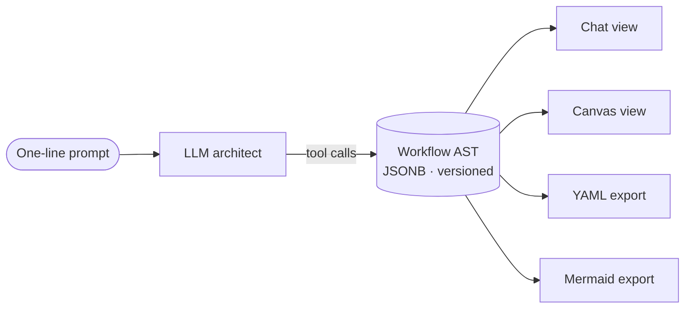

# Agent Designer

The **Agent Designer** turns a one-line prompt — *"a research agent over our docs
index plus the public web, with reflection, under 30 seconds"* — into a runnable
multi-agent workflow, without writing code.

## How it works

An LLM **architect** assembles a typed workflow **AST** through tool calls. A chat
panel and a visual canvas are two synchronized views over that same AST:

- **Chat** — describe what you want; the architect proposes and applies changes.
- **Canvas** — see and directly edit the workflow graph.

YAML and Mermaid are deterministic **export** formats. The AST itself — stored as
JSONB on Lakebase with immutable revisions — is the source of truth.

## A legible, staged process

The Designer surfaces its work as user-relevant progress rather than backend
internals, moving through stages such as:

> Understanding request → Checking sources → Interpreting data needs → Planning data
> access → Drafting workflow → Validating workflow → Ready to apply

Each stage leads with the outcome, then the evidence (named data sources, tool
readiness), then collapsible technical detail.

## Workflow modes

A Custom Agent can control *how* research runs:

| Mode | Behavior |
|------|----------|
| **Planner** | The AI generates the full research plan from scratch |
| **Manual** | Only your predefined steps run — fully deterministic and reproducible |
| **Hybrid** | Your preset steps run first, then the AI adds more if it finds gaps |

You can also pin data-source scope (include/exclude sources by name, domain filters),
override model tiers, lock a research depth, and attach custom system prompts and
synthesis templates — including structured JSON output schemas for downstream
pipelines.

## Five deployment targets

A designed agent deploys from the **same AST** to any of five runtime targets:

| Target | What it is |
|--------|------------|
| **In-App** | Run inside this application |
| **MLflow Agent** | A Model Serving endpoint |
| **Shell App** | A standalone Databricks App with the framework bundled as a wheel, per-request OBO |
| **Spark Batch** | Run the agent over a Delta table column |
| **Programmatic** | Direct serving via the Python API |

## Go deeper

- [Agent Designer (full docs)](https://github.com/mshtelma/databricks-deep-research-agent/blob/main/docs/agent-designer.md)
- [Deploying a designed agent](https://github.com/mshtelma/databricks-deep-research-agent/blob/main/docs/agent-deployment.md)
