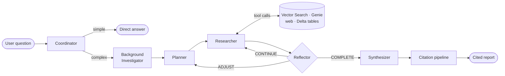

# The 5-Agent System

Deep Research Agent decomposes research into five specialized agents that
collaborate in an iterative, self-correcting loop. The key idea is **step-by-step
reflection**: after every research step, the system asks itself whether to keep
going, change direction, or finish.

## The agents

**Coordinator.** Classifies the question's complexity and routes it to the right
pipeline — a fast direct answer for simple lookups, or full research for complex
questions.

**Background Investigator** *(optional)*. A pre-research phase that gathers
contextual signals before planning begins.

**Planner.** Designs the research strategy: which aspects to investigate, in what
order, and using which data sources.

**Researcher.** Executes each step, calling the appropriate tools (Vector Search,
Genie, web crawl, Delta tables) and collecting evidence. Runs in one of two modes:

- **`classic`** — a fixed set of searches/crawls per step (fast, predictable).
- **`react`** — a ReAct loop where the LLM controls tool calls within a budget
  (more intelligent).

**Reflector.** After each step, evaluates coverage and emits one of three decisions:

| Decision | Meaning |
|----------|---------|
| `CONTINUE` | Evidence is incomplete — run another research step |
| `ADJUST` | Shift focus or re-plan around a gap |
| `COMPLETE` | Enough evidence has been gathered — synthesize |

**Synthesizer.** Produces the comprehensive, evidence-grounded report — then hands
off to the [citation pipeline](citation-pipeline.md) for verification.

## Why reflection matters

Because the Reflector runs **after each step** (not just once at the end), the system
adapts its effort to the difficulty of the question. A straightforward question may
complete in a single cycle; a hard analytical question can run up to 10 cycles, each
building on what was learned in the previous one. This is what separates *deep
research* from *single-shot RAG*.

## Builtin subtypes

In the framework these map to registered builtin agent subtypes — `coordinator`,
`planner`, `researcher`, `reflector`, `synthesizer`, and `background` — each with its
own prompt templates and tunable behavior. Custom workflows can override any of them.

## Go deeper

- [5-Agent system (full docs)](https://github.com/mshtelma/databricks-deep-research-agent/blob/main/docs/agents.md)
- [Builtin agents reference](https://github.com/mshtelma/databricks-deep-research-agent/blob/main/databricks-deep-research/docs/guides/builtin-agents.md)
