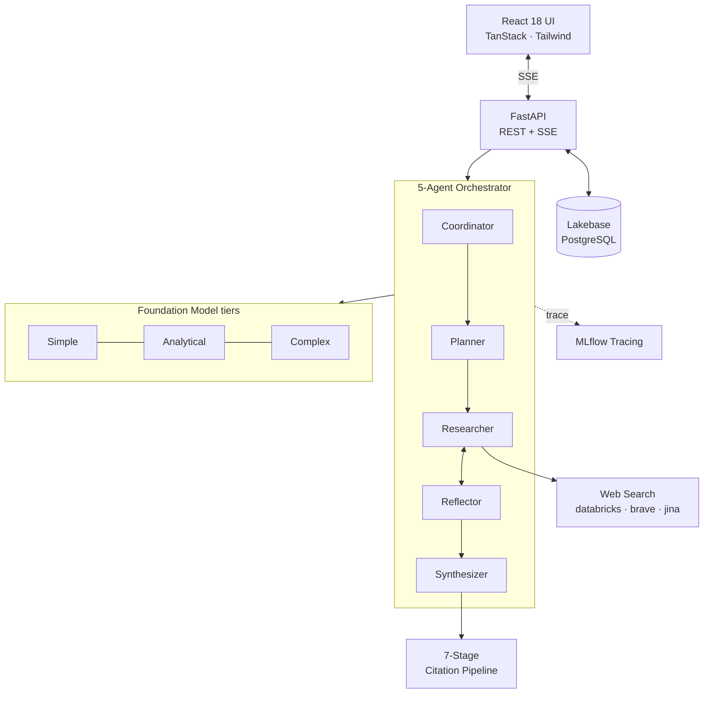

# Architecture

Deep Research Agent is a **uv workspace monorepo** with two packages:

- **`databricks-deep-research`** — a standalone, YAML-driven multi-agent
  orchestration framework (PyPI-publishable).
- **`databricks-deep-research-app`** — a FastAPI + React application that uses the
  framework and deploys as a Databricks App.

## System at a glance

## Layers

- **Frontend** — React 18 + TypeScript with TanStack Query and Tailwind. Streaming
  is delivered over **Server-Sent Events** (not WebSockets), and stream state is
  preserved across browser refreshes.
- **API** — FastAPI with a middleware stack (auth → CSRF → security headers → audit
  → request logging) and a versioned `/v1` REST surface.
- **Orchestrator** — the framework's plan-and-execute runtime drives the five agents
  through an append-only `RuntimeState`. Workflows are defined in YAML and validated
  for dangling reads / dead stores at load time.
- **Citation pipeline** — a 7-stage verification stage runs before the report is
  finalized. [Details →](citation-pipeline.md)
- **Persistence** — Databricks **Lakebase** (PostgreSQL) with OAuth tokens that
  auto-refresh, atomic persistence, and event-sourced chat state.
- **Observability** — MLflow 3.8+ tracing across the whole pipeline.

## Tiered model routing

Rather than using one model for everything, the framework routes each stage of the
pipeline to an appropriate tier, with automatic fallback if an endpoint is rate-limited
or unavailable:

| Tier | Used for | Example model class |
|------|----------|---------------------|
| **Simple** | Classification, routing, lightweight tasks | Fast / cheap (e.g. Gemini Flash) |
| **Analytical** | Tool-calling research steps, reasoning | Mid-tier (e.g. Claude Sonnet) |
| **Complex** | Final synthesis, hard reasoning | Frontier (e.g. Claude Opus / ER) |

Each tier supports multiple fallback endpoints, prompt caching where available, and
per-endpoint health tracking with backoff + jitter. [Tune it in Configuration →](../guides/configuration.md)

## Technology stack

| Component | Technology | Version |
|-----------|------------|---------|
| Backend | Python | 3.11+ |
| Frontend | TypeScript / React | 18.x |
| Orchestration | `databricks-deep-research` | 0.2.0 |
| API framework | FastAPI | 0.109+ |
| Database | Databricks Lakebase (PostgreSQL) | — |
| LLM client | AsyncOpenAI (via WorkspaceClient) | 1.10+ |
| Observability | MLflow | 3.8+ |
| Web scraping | Trafilatura | 2.0+ |

!!! note "Plain async Python orchestration"
    The orchestration layer is plain `async` Python — **not** LangGraph, DSPy, or
    AutoGen. This keeps control flow explicit, debuggable, and free of framework
    lock-in.

## Go deeper

The framework ships ~70 pages of reference documentation in the repo:

- [Application architecture (full)](https://github.com/mshtelma/databricks-deep-research-agent/blob/main/docs/architecture.md)
- [Framework documentation index](https://github.com/mshtelma/databricks-deep-research-agent/blob/main/databricks-deep-research/docs/index.md)
