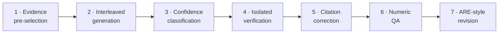

# Citation Pipeline

Most systems append citation numbers to text *after* generation — a cosmetic gesture
that doesn't guarantee the cited source actually supports the claim. Deep Research
Agent takes a different approach: a **7-stage citation verification pipeline** that
grounds every factual claim in evidence and assigns each citation a verdict.

## The seven stages

1. **Evidence pre-selection** — rank and select the most relevant evidence spans
   from all collected sources.
2. **Interleaved generation** — instead of writing the report then bolting on
   citations, each claim is generated *alongside* its supporting source material.
3. **Confidence classification** — every claim is tagged high / medium / low
   confidence; low-confidence claims are escalated.
4. **Isolated verification** — an independent LLM evaluation produces a verdict for
   each escalated claim: **supported**, **refuted**, or **insufficient evidence**.
5. **Citation correction** — citations that don't hold up are automatically rebound
   to stronger supporting sources from the evidence pool.
6. **Numeric QA** — numeric claims get dedicated checks for exact matches, range
   overlaps, and percentage-level accuracy.
7. **ARE-style revision** — as a final safety net, claims with insufficient evidence
   are decomposed into atomic facts and checked against additional sources.

## What the user sees

Every citation in the final report carries a **confidence badge** and a
**verification verdict**, visible in the UI as claims are checked — live. Users can
tell at a glance which statements are strongly supported, which are partial, and which
have gaps, making the AI's reasoning transparent and auditable.

!!! note "Grounding warnings, not silent failure"
    When the verifier can't produce real entailment judgments, the synthesizer emits
    the report with a visible grounding warning rather than a misleading "verified"
    badge. Honesty about uncertainty is a first-class feature.

## Scientific foundations

The pipeline implements patterns from peer-reviewed research:

| Pattern | Paper | Application |
|---------|-------|-------------|
| **ReClaim** | [arXiv:2407.01796](https://arxiv.org/abs/2407.01796) | Interleaved generation with evidence constraints |
| **FActScore** | [arXiv:2305.14251](https://arxiv.org/abs/2305.14251) | Atomic fact decomposition |
| **SAFE** | [arXiv:2403.18802](https://arxiv.org/abs/2403.18802) | Multi-step reasoning with search |
| **ARE** | [arXiv:2410.16708](https://arxiv.org/abs/2410.16708) | Atomic facts for retrieval |
| **CoVe** | [arXiv:2309.11495](https://arxiv.org/abs/2309.11495) | Isolated verification |
| **CiteFix** | [arXiv:2504.15629](https://arxiv.org/abs/2504.15629) | Hybrid citation correction |
| **QAFactEval** | [arXiv:2112.08542](https://arxiv.org/abs/2112.08542) | QA-based numeric verification |

## Go deeper

- [Citation pipeline (full docs)](https://github.com/mshtelma/databricks-deep-research-agent/blob/main/docs/citation-pipeline.md)
- [Scientific foundations](https://github.com/mshtelma/databricks-deep-research-agent/blob/main/docs/scientific-foundations.md)
- [See the accuracy numbers](../benchmarks.md)
